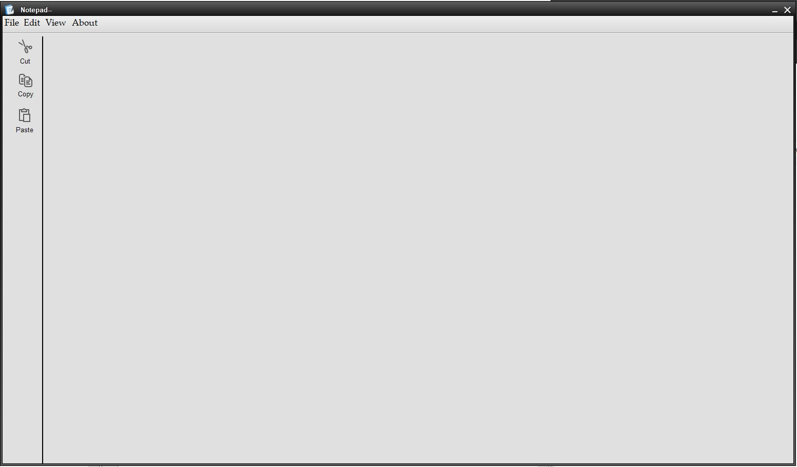
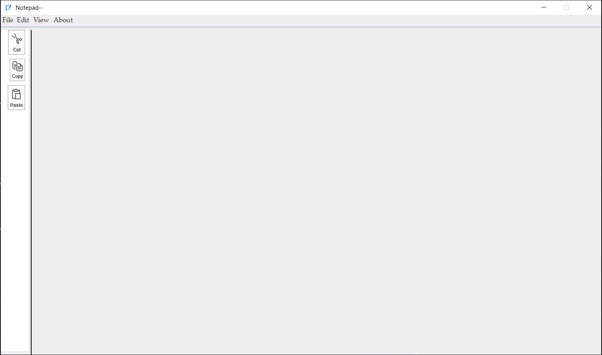

## Notepad-using-java-

> Basicaly a Notepad build using java  .

Its a notepad build using java ,,,
user interface is different as compared to the original notepad .
It has short cuts for copy paste . It can do all other things that Notepad does ,

The NOtepad is two themed one is black while other is white . Check out Both .
For Black theme jtatoo is used .

## Installation
#for direct use :-
.exe file is provided in the check it out .(Requires JDK )
Also ,you can also chekckout the jar files .
The entire code is based on JDK 1.8 might show some problems in newest versions .

#for code:-
just fork and clone this repo

## Development setup

You can either run the  .exe files or jre .
Make sure you have JDK installed in your system.
The entire code is based on JDK 1.8 might show some problems in newest versions .

## Contributing

0. Fork it 
1. Commit your changes 
2. Push to the branch 
3. Create a new Pull Request

Redy for changes .
Feel free for Contributing .

